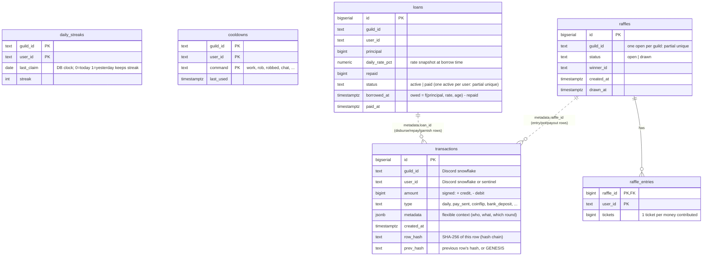
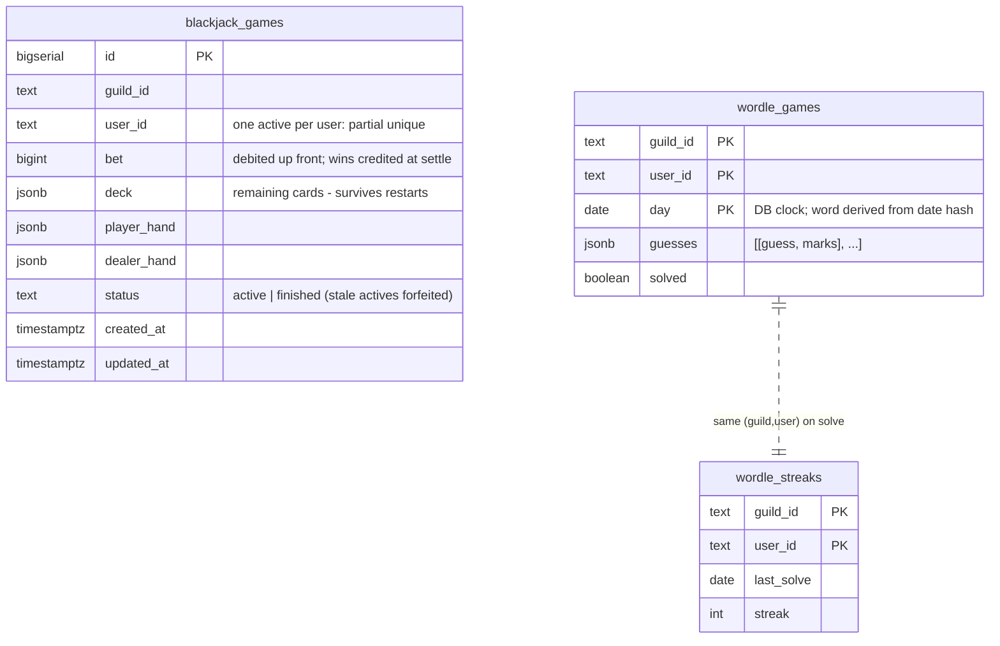
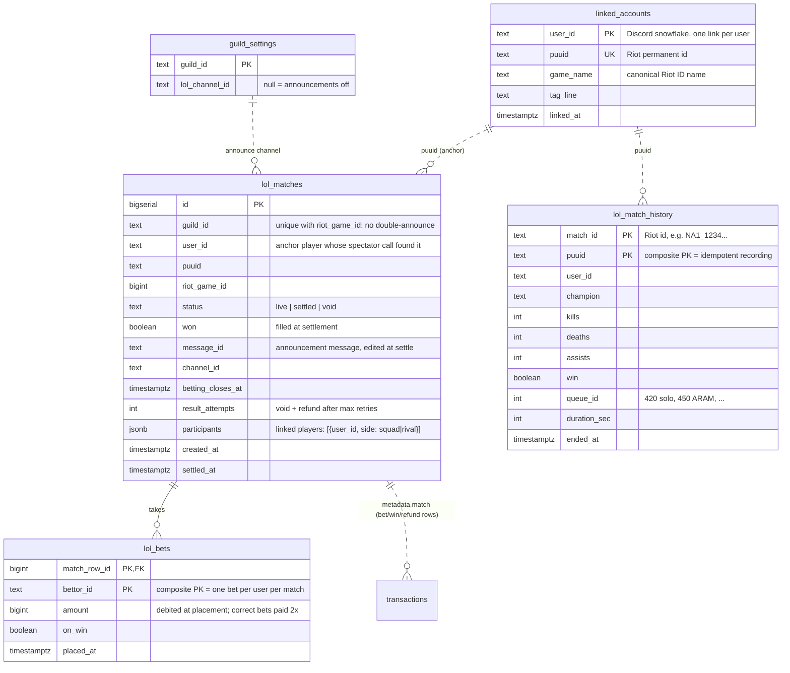
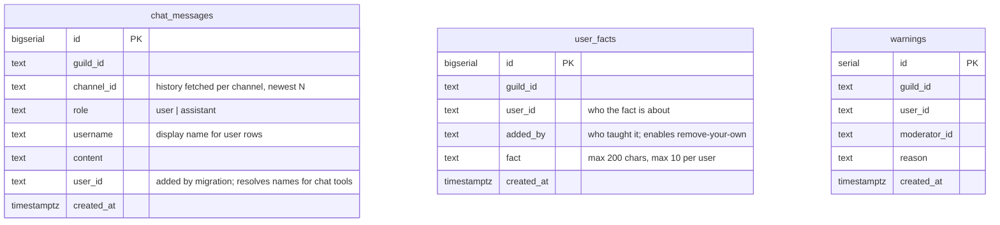
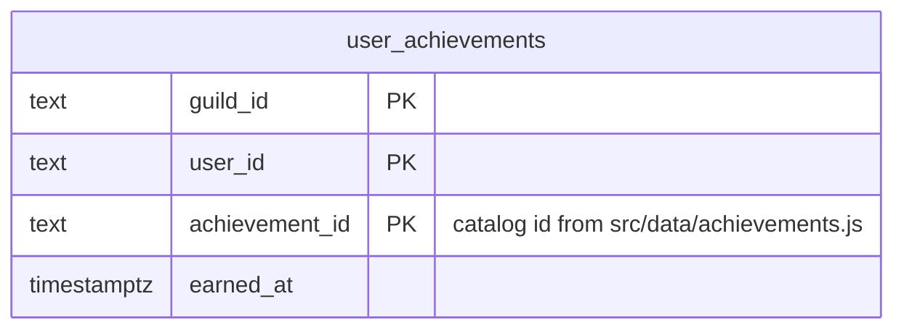

# Database Model

The relational model behind the bot, as ER diagrams with design notes.

> **Maintenance rule:** this document mirrors `initDatabase()` in
> `src/database/db.js`. Any schema change there — new table, new column,
> new index — updates this file in the same commit. The diagrams are
> Mermaid, so GitHub renders them and changes show up in diffs.

## Design principles

1. **Discord is the authority for people and places.** There is no `users`
   or `guilds` table — `guild_id` / `user_id` columns hold Discord
   snowflake IDs (as TEXT, since they overflow 32-bit ints and we never do
   math on them). That's why most "relationships" below are *logical*
   (dotted), not foreign keys: the parent rows live in Discord, not here.
2. **Derive, don't store.** Balances, banked totals, and loan debt are
   computed at read time from source-of-truth rows. Only two real FKs
   exist (`raffle_entries → raffles`, `lol_bets → lol_matches`) because
   those parents genuinely live in our schema.
3. **The ledger is append-only and hash-chained.** `transactions` is the
   heart of the model: never UPDATE or DELETE a row (except the one-time
   `row_hash` stamp at insert); every row commits to the previous one via
   SHA-256, so `/audit` can prove history unedited.
4. **Partial unique indexes enforce "one active X".** One open raffle per
   guild, one active blackjack game per player, one active loan per
   borrower — enforced by the database, not by application discipline.
5. **Composite primary keys make writes idempotent.** Recording the same
   LoL match twice, double-betting a match, replaying a wordle day, or
   re-earning an achievement inserts nothing instead of corrupting state.
6. **The database clock is the only clock.** Cooldowns, streaks, and the
   wordle day all use `now()` / `CURRENT_DATE` so behavior doesn't depend
   on where the bot process runs.

## Economy core

`transactions` is the hub of the whole model. Every monies movement — pay,
gamble, rob, raffle, loan, bank — is a signed row here; `type` + `metadata`
say why. The raffle pot itself is a ledger "user" (the `__raffle_jar__`
sentinel), so even the pot is auditable.

**Derived values (never stored):** wallet = `SUM(amount)`; banked =
`-SUM(amount) FILTER (type IN bank_deposit, bank_withdraw)`; loan owed =
`ceil(principal × (1 + rate% × age_days)) - repaid`; lifetime earned =
`SUM` over positive `daily`/`work` rows (feeds the credit limit).

## Games

Game *money* lives in `transactions` (types `blackjack_bet`, `slots`,
`coinflip`, `wordle`, ...). These tables hold game *state*.

## League of Legends

`linked_accounts` is the root: it maps a Discord user to a Riot PUUID
(permanent even through name changes). The poller fans out from there.

## Chat & social

## Achievements

The catalog (names, tiers, check functions) lives in code —
`src/data/achievements.js` — so new achievements never need schema
changes. This table only records who earned what. Awarding uses
`INSERT ... ON CONFLICT DO NOTHING RETURNING` (the welcome-bonus
pattern): a returned row means "newly earned, announce it". Checks run
*after* money transactions commit, never inside them.

## Indexes at a glance

| Index | Table | Purpose |
| --- | --- | --- |
| `(guild_id, user_id)` | transactions, warnings, user_facts | the dominant lookup everywhere |
| `(channel_id, created_at DESC)` | chat_messages | "newest N in this channel" |
| `(puuid, ended_at DESC)` | lol_match_history | "this player's games, newest first" |
| `(status)` | lol_matches | the poller's live-match watchlist |
| **unique** `(guild_id, riot_game_id)` | lol_matches | idempotent match detection |
| **partial unique** `(guild_id) WHERE status='open'` | raffles | one open raffle per guild |
| **partial unique** `(guild_id, user_id) WHERE status='active'` | blackjack_games, loans | one active game/loan per user |

## Anticipated extensions (from docs/IDEAS.md — not built yet)

Sketches only, to think ahead; update or delete as features land.

- **Shop / buyable roles** — `shop_items (guild_id, role_id, price)` +
  purchases as ledger rows (`type='shop_purchase'`, `metadata.role_id`).
  No owned-items table needed if Discord roles are the source of truth.
- **Heist events** — `heists (id, guild_id, status, buyin, opens_at,
  resolves_at)` + `heist_entries (heist_id FK, user_id)`; the pot follows
  the raffle-jar sentinel pattern.
- **Stock market** — the deep one: `stocks (symbol, guild_id)` +
  append-only `stock_prices (symbol, tick_at, price)` + holdings derived
  from signed `stock_trades` rows — same derive-don't-store philosophy as
  the ledger.
- **Genshin wish tracker** — the founding idea's "deep schema problem":
  `wishes (user_id, banner_id, item, rarity, pulled_at)` with per-banner
  pity derived at read time by counting rows since the last 5★.
- **Birthdays / reminders / quotes** — small `(guild_id, user_id, ...)`
  tables; birthdays likely just a column-less DATE table, quotes an
  append-only message archive.
